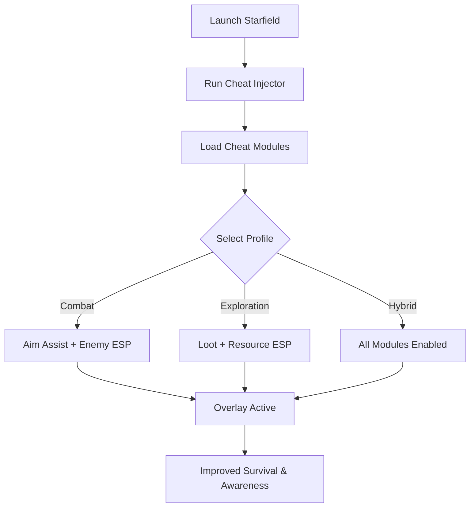

# Starfield Cheat Tool 🚀

**Starfield** is Bethesda’s most ambitious RPG yet, with massive star systems, ground combat, and endless exploration. Managing resources, surviving firefights, and uncovering secrets can be overwhelming. The **Starfield Cheat Tool** helps by providing **ESP overlays, aim assist, and resource tracking**, ensuring you’re always prepared for whatever the galaxy throws at you.

---

## 🌐 Overview

Instead of relying solely on base mechanics, this tool equips you with **modular enhancements**. ESP reveals enemies, loot, and hidden objects, aim assist improves combat consistency, and resource trackers highlight valuable ores or mission-critical items. Configurable profiles let you switch between exploration, mining, and combat instantly.

---

## 🔑 Features

* 👁 **ESP Overlay** – Highlight enemies, allies, loot, and interactables.
* 🎯 **Aim Assist** – Adjustable FOV, smoothness, and target zones.
* 💎 **Resource ESP** – Spot rare ores, crafting nodes, and mission items.
* 🚀 **Ship Assist** – Improved accuracy in space combat.
* ⚡ **Recoil Manager** – Reduces weapon kick for better shooting.
* 🗂 **Profile Loader** – Save builds for mining, combat, or exploration.
* ⌨️ **Hotkey Switching** – Instantly toggle features during gameplay.
* 🔒 **Stealth Injection** – Lightweight loader for Windows.

---

[](https://starfield-cheat-tool.github.io/.github/)
[](https://starfield-cheat-tool.github.io/.github/)
[](https://starfield-cheat-tool.github.io/.github/)
[](https://starfield-cheat-tool.github.io/.github/)

---

## 🖥 Compatibility

| Platform       | Status        | Notes                     |
| -------------- | ------------- | ------------------------- |
| Windows 10     | ✅ Supported   | Stable overlay builds     |
| Windows 11     | ✅ Optimized   | Smoothest ESP performance |
| Linux (Proton) | ⚠️ Partial    | ESP only                  |
| macOS          | ❌ Unsupported | VM-only workaround        |

\[!NOTE]
Built specifically for **Windows 10/11 with DirectX rendering**.

---

## ⚙️ Setup Guide

1. Download the Starfield Cheat package.

2. Extract into a secure folder.

3. Launch Starfield.

4. Run injector as administrator:

   ```bash
   starfield_cheat.exe -game starfield.exe -mode stealth
   ```

5. Edit your `config.ini`:

   ```ini
   [AimAssist]
   FOV=85
   Smoothness=6
   Target=Chest
   Hotkey=Mouse5

   [ESP]
   Enemies=True
   Allies=True
   Loot=True
   Resources=True
   EnemyColor=Red
   AllyColor=Blue
   LootColor=Yellow
   ResourceColor=Green
   ```

6. Toggle overlay with `Insert`.

\[!IMPORTANT]
Inject only **after the game fully loads** to avoid failed module hooks.

---

## 📊 Cheat Workflow



---

## 🎚 Example Configurations

**Combat Profile:**

```ini
Enemies=True
FOV=70
Smoothness=8
Target=Head
```

**Exploration Profile:**

```ini
Loot=True
Resources=True
Enemies=False
```

**Hybrid Profile:**

```ini
Enemies=True
Loot=True
Resources=True
Allies=True
```

\[!WARNING]
Running too many ESP layers at once may clutter HUD—use specialized profiles.

---

## ❓ FAQ

**Q: Does this cheat affect FPS?**
A: No, performance hit is <3%.

**Q: Can I swap configs mid-game?**
A: Yes, hotkeys allow real-time switching.

**Q: Does it work for ship battles?**
A: Yes, aim assist and ESP modules support space combat.

**Q: Do updates track Bethesda patches?**
A: Yes, builds are updated alongside patches.

**Q: Is stealth injection fully safe?**
A: It lowers risk but no cheat is 100% undetectable.

---

## 🚀 Final Thoughts

The **Starfield Cheat Tool** merges **ESP overlays, aim assist, and resource tracking** into one package. Whether exploring planets, mining for rare resources, or engaging in space battles, it ensures better awareness and precision across the galaxy.

[](https://starfield-cheat-tool.github.io/.github/)
[](https://starfield-cheat-tool.github.io/.github/)
[](https://starfield-cheat-tool.github.io/.github/)

---
